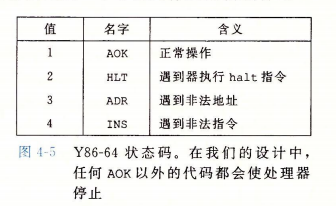

## 第1章：计算机系统漫游

* 计算机系统是由**硬件**和**系统软件**组成的（P1）

#### 1.1：信息就是位+上下文

* ASCII字符表

	

* 只由ASCII字符构成的文件称为**文本文件**，所有其它文件称为**二进制文件**

#### 1.2：程序被其他程序翻译成不同的格式

###### 编译系统的构成

编译系统由预处理器（cpp）、编译器（ccl）、汇编器（as）、链接器（ld）组成


* 预处理阶段，即预编译，根据代码中以`#`开头的命令，修改原始的C代码，生成`.i`文件
* 编译阶段，编译器将`.i`翻译成汇编语言程序`.s`
* 汇编阶段，汇编器将`.s`翻译成机器语言指令，将这些指令打包成可重定位目标程序的格式，保存为`.o`
* 链接阶段，链接器负责将涉及到的`.o`文件合并起来，生成可执行文件

#### 1.4：处理器读并解释储存在内存中的指令

###### 1.4.1：系统的硬件组成

* **总线**，通常被设计成传送定长的字节块，也就是字。字的字节数是基本的系统参数，通常为地址的长度
* **IO设备**
* **主存**，通常按字节寻址
* **处理器**，处理器的核心是大小为一个字的存储设备，称为程序计数器

#### 1.6：存储器形成层次结构


#### 1.7：操作系统管理硬件

* 操作系统的两个基本功能：（1）防止硬件被失控的应用程序滥用；（2）向应用程序提供简单一致的机制来控制复杂而又通常大不相同的低级硬件设备

* 文件是对IO设备的抽象表示；
	虚拟内存是对主存和磁盘IO设备的抽象表示；
	进程是对处理器、主存和IO设备的抽象表示
	
	

###### 1.7.3：虚拟内存


* **程序代码和数据**，对所有的进程来说，代码从同一固定地址开始，紧接着是和C全局变量相对应的数据位置。

* **堆**，调用`malloc`和`free`这样的函数时，堆可以动态地拓展和收缩。

* **共享库**

* **栈**

* **内核虚拟内存**，不允许应用程序读写这个区域的内容或者直接调用内核代码定义的函数

#### 1.9：重要主题

###### 1.9.2：并发和并行

* **并发**，指一个同时具有多个活动的系统
* **并行**，指用并发来使一个系统运行得更快

## 第2章：信息的表示和处理

#### 2.1：信息存储

###### 2.1.2：字数据大小

* 每台计算机都有一个字长，表明指针数据的标称大小。因为虚拟地址是以这样的一个字来编码的。

	

###### 2.1.3：寻址和字节顺序

大端法和小端法，对于变量`int x=0x01234567`。大多数Intel兼容机采用小端模式


#### 2.2：整数表示

###### 2.2.1：整型数据类型

C语言整形数据保证的最小取值范围


###### 2.2.2：无符号数的编码

$$
B2U_w(\vec{x})=\overset{w-1}{\underset{i=0}{\Sigma}}x_i2^i
$$

###### 2.2.3：补码编码

最高位为符号位，有负权重$2^{w-1}$
$$
B2T_w(\vec{x})=-x_{w-1}2^{w-1}+\overset{w-2}{\underset{i=0}{\Sigma}}x_i2^i
$$

* 反码和原码存在`+0`和`-0`现象

###### 2.2.4：有符号数和无符号数之间的转换

强制类型转换的结果保持位值不变，只是改变了解释这些位的方式

###### 2.2.5：C语言中的有符号数与无符号数

* 当执行一个运算时，如果它的一个运算数是有符号的而另一个是无符号的，那么C语言会隐式地将有符号参数类型转换为无符号数，并假设这两个数都是非负的，来执行这个运算
###### 2.2.6：扩展一个数字的位表示
* 对于`short sx`，`(unsigned)sx`实际上为`(unsigned)(int)sx`，即先进行补码拓展，再进行类型转换

#### 2.3：整数运算
###### 2.3.1：无符号加法

对于`w`位无符号数`x,y,s`，其中`s=x+y`当且仅当`s<x`（等价于`s<y`）时，产生了溢出

###### 2.3.2：补码加法

对于`w`位有符号数补码`x,y,s`，其中`s=x+y`

当且仅当`x>0,y>0,s<=0`，发生正溢出；

当且仅当`x<0,y<0,s>=0`，发生负溢出

###### 2.3.3：补码的非

对于`w`位补码数`x`


计算方法，设`k`为`x`最右边的`1`的位置，即
$$
x=[x_{w-1},x_{w-2},\cdots,1,0,\cdots,0]
$$
有
$$
-x=[~x_{w-1},~x_{w-2},\cdots,1,0,\cdots,0]
$$
即`k`位之前的所有位取反，例如`x=1100,-x=0100`

#### 2.4：浮点数

###### 2.4.2：IEEE浮点表示

阶码用**移码**表示，即补码的符号位取反。这么做便于大小的比较

> 如果阶码（指数）也用补码来表示，就会使得一个浮点数中出现两个符号位：浮点数自身的和浮点数指数部分的。这样的结果是，在比较两个浮点数大小时，无法像比较整数时一样使用简单的无逻辑的二进制比较


###### 2.4.4：舍入

* 向偶数舍入，当不取中间值时，就近舍入，如`1.4->1`，`1.6->2`；

	当取中间值时，舍入使得最低有效数字是偶数，如`1.5->2`，`2.5->2`

## 第3章：程序的机器级表示

#### 3.4：访问信息

**x86-64**包含一组16个存储64位的通用目的寄存器

* `%rdi,%rsi,%rdx,%rcx,%r8,%r9`依次为第1到第6个参数，多余参数保存在栈中
* `%rbx,%rbp,%r12,%r13,%r14,%r15`均为调用者（caller）保存
* `%rax`为默认的返回值


8086中的段寄存器，指明段的起始地址

* **CS**代码段
* **DS**数据段
* **SS**堆栈段
* **ES**附加段

在8086体系中，汇编指令中操作数长度标识

整数

* **b**：字节
* **w**：字，占2个字节
* **l**：双字，占4个字节
* **q**：四字，占8个字节

浮点数

* **s**：单精度浮点数
* **l**：双精度浮点数

###### 3.4.2：数据传送指令

**无条件传送指令**

指令格式

* `mov* src,dst`，`*`可以是`b,w,l,q`中之一，也可以是空白，分别表示1/2/4/8字节。对于指令`movl src,dst`，当`dst`为寄存器时，该指令会将该寄存器的高4字节置零
* `movabsq imm,reg`，将任意64位立即数作为源操作数，`reg`只能为寄存器

操作数类型

* 立即数
* 寄存器，可以是16个整数寄存器之一，但不能用`%rsp`（系统保留），也不能用其他特殊指令专用寄存器
* 内存

单条`mov`指令不能进行从内存到内存的数据传送

**拓展传送指令：按零拓展**

指令格式

* `movz* src,reg`，`*`可以是`bw,bl,wl,bq,wq`中之一，前一个字母为源的大小，后一个字母为指定目的的大小，例如`bw`为将做了零拓展的字节传送到字

操作数类型

* `src`可以是寄存器或内存
* `reg`只能是寄存器

**拓展传送指令：按符号拓展**

指令格式

* `movs* src,reg`，`*`可以是`bw,wl,wl,bq,wq,lq`中之一，前一个字母为源的大小，后一个字母为指定目的的大小，例如`bw`为将做了符号拓展的字节传送到字
* `cltq`，将`%eax`符号拓展到`%rax`

操作数类型

* `src`可以是寄存器或内存
* `reg`只能是寄存器

**条件传送指令**

指令格式

* `cmov* reg,dst`，`*`为一个或两个字符，作为条件，后面还可以接`b,w,l,q`作为长度；条件字符为`g,l,e,n,o`分别表示大于、小于、等于、否、溢出；例如`cmovgel`为当大于或等于时传送一个双字


###### 3.4.4：压入和弹出栈数据

指令格式

* `push src`，其行为是

```
%rsp	=	%rsp - 8
M[%rsp]	=	src
```

* `pop dst`，其行为是

```
dst		=	M[%rsp]
%rsp	=	%rsp + 8
```

#### 3.5：算术和逻辑操作

**常见整数算术操作**


###### 3.5.1：加载有效地址

指令格式

* `leaq src,dst`

操作数格式

* `src`是源地址模式表达式，如`(%rax,%rdi,4)`，`6(%rax)`等

`lea`指令不涉及内存引用，也不会改变标志位，可以用来计算形如`x+k*y`的算术表达式

###### 3.5.3：移位操作

移位操作的移位量可以是一个立即数，或者放在单字节寄存器`%cl`中

###### 3.5.5：特殊的算术操作

利用`%rdx:%rax`组成一个八字（128位）数据

默认的被乘数和被除数分别为`%rax`，`%rdx:%rax`

`S`默认为乘数和除数


对于64位全乘法，源操作数与`%rax`相乘，高64位存在`%rdx`，低64位存在`%rax`

对于64位除法，`%rdx`存放余数，`%rax`存放商

#### 3.6：控制

###### 3.6.1：条件码

常用条件码

* **CF**，进位标志。从无符号计算角度判断
* **ZF**，零标志。
* **SF**，符号标志。结果为负数
* **OF**，溢出标志。从有符号计算角度判断

特殊指令的行为

* `leaq`指令不改变任何条件码
* 对于逻辑操作，例如`xor`，进位标志和溢出标志置零
* 对于移位操作，进位标志设置为最后一个移出的位；溢出标志置零
* `inc`和`dec`指令会设置`OF`和`ZF`，但是不会改变`CF`

比较和测试指令


不改变目的寄存器的值，仅设置条件码

###### 3.6.2：访问条件码

`set`指令，根据条件码，将一个字节置零或置一


`greater/less`为有符号数的比较；`above/below`为无符号数的比较

###### 3.6.3：跳转指令


在机器实现上，`j* x`满足`%PC = x+%PC`，在计算之前，`%PC`为跳转指令的下一条指令的地址


###### 3.6.7：循环

**do-while循环**

通常汇编形式

```assembly
loop:
	body-statement
	t = test-expression;
	if(t)
		goto loop;
	...
```

**while循环**

通常汇编形式

* 跳转到中间（*jump to middle*）

```assembly
	goto test;
loop:
	body-statement
test:
	t = test-expression;
	if(t)
		goto loop;
```

* *guarded-do*

```assembly
	t = test-expression;
	if(!t)
		goto done;
loop:
	body-statement
	t = test-expression;
	if(t)
		goto loop;
done:
	...
```

**for循环**

通常汇编形式

* 跳转到中间（*jump to middle*）

```assembly
	init-expression;
	goto test;
loop:
	body-statement
	update-expression;
test:
	t = test-expression;
	if(t)
		goto-loop;
```

* *guarded-do*

```assembly
	init-expression;
	t = test-expression;
	if(!t)
		goto done;
loop:
	body-statement
	update-expression;
	t = test-expression;
	if(t)
		goto loop;
done:
	...
```

###### 3.6.8：switch语句

`switch`语句根据一个整数索引值进行多重分支，通过使用跳转表使得实现更加高效。


`index`为生成的变量，通过对`n`进行计算得来（缩小原索引值的范围），从上到下递增，初值为0

#### 3.7：过程

假设过程`P`调用过程`Q`，`Q`执行后返回到`P`，动作包括下面一个或多个机制

* **传递控制**，在进入过程`Q`的时候，程序计数器必须被设置为`Q`的代码的起始地址，然后在返回时，要把程序计数器设置为`P`调用`Q`指令的下一条指令的地址
* **传递数据**，`P`必须能够向`Q`提供一个或多个参数，`Q`必须能够向`P`返回一个值
* **分配和释放内存**，在开始时，`Q`可能需要为局部变量分配空间，在返回前又必须释放这些空间

###### 3.7.1：运行时栈

通用的栈帧结构


###### 3.7.2：转移控制

`call`指令和`ret`指令


###### 3.7.3：数据传送

默认情况下，通过寄存器，可以传送6个参数，参数依次存放的顺序为`%rdi,%rsi,%rdx,%rcx,%r8,%r9`

如果一个函数有大于6个整型参数，超过6个的部分就要通过栈来传递

###### 3.7.4：栈上的局部存储

运行时栈提供了在需要时分配，函数完成时释放局部存储的机制（分配栈即`%rsp`值减小，释放即`%rsp`增加回原来分配的尺寸）

###### 3.7.5：寄存器中的局部存储空间

根据惯例，`%rbx,%rbp,%r12,%r13,%r14,%r15`被划分为**被调用者保存（callee）**寄存器。当过程`P`调用`Q`时，`Q`必须保护这些寄存器的值（不予更改或者压入栈中）

所有的其他寄存器，除了栈指针`%rsp`之外都划分为**调用者保存（caller）**寄存器，这意味着任何函数都可以修改他们，调用之前的保护是`P`的责任

#### 3.9：异质的数据结构

###### 3.9.3：数据对齐

通常的对齐原则是任何**K**字节的基本对象的地址必须是**K的倍数**

#### 3.10：在机器级程序中将控制与数据结合起来

###### 3.10.3：内存越界引用和缓冲区溢出

在栈中分配某个字符数组来保存一个字符串，但是字符串的长度超出了为数组分配的空间。

###### 3.10.4：对抗缓冲区溢出攻击

* **栈随机化**

使得栈的位置在程序每次运行时都有变化，程序开始时，在栈上分配`0~n`字节的随机大小的空间。程序不使用这段空间，但是它会导致程序每次执行时后续的栈位置发生了变化

* **栈破坏检测**

在栈帧中任何局部缓冲区与栈状态之间存储一个特殊的**金丝雀**值，在每次运行时随机产生。在恢复寄存器状态和从函数返回之前，检查该值是否改变（将栈中的金丝雀与段中的只读值进行比较）


* **限制可执行代码区域**

#### 3.11：浮点代码

* 媒体寄存器


###### 3.11.1：浮点传送和转换操作

**浮点传送指令**


**双操作数浮点转换指令**


**三操作数浮点转换指令**


###### 3.11.2：过程中的浮点代码

* XMM寄存器`%xmm0~%xmm7`最多可以传递8个浮点参数，按照参数列出的顺序使用这些寄存器，可以通过栈传递额外的浮点参数
* 函数使用寄存器`%xmm0`来返回浮点值
* 所有的XMM寄存器都是**调用者保存**，被调用者可以不保存就覆盖其中任意一个

当函数包含指针、整数和浮点数混合的参数时，指针和整数就通过寄存器传递，而浮点值通过XMM寄存器传递。

###### 3.11.3：浮点运算操作

每条指令有一个或两个源操作数`(S1,S2)`和一个目的操作数`D`，其中，`S2,D`必须是XMM寄存器


###### 3.11.4：定义和使用浮点常数

AVX浮点操作不能以立即数作为操作数，编译器必须为所有的常量值分配和初始化存储空间，然后代码再把这些值从内存读入

###### 3.11.5：在浮点代码中使用位级操作


###### 3.11.6：浮点比较操作

当任一操作数为`NaN`时，就会出现无序的情况，此时`PF`置1


## 第4章：处理器体系结构

#### 4.1：Y86-64指令集体系结构

###### 4.1.1：程序员可见的状态

在Y86-64体系结构中，有15个64位程序寄存器：`%rax,%rcx,%rdx,%rbx,%rsp,%rbp,%rsi,%rdi,%r8~%r14`；有一个程序计数器`PC`

有3个条件码：`ZF,SF,OF`；有状态码`Stat`


###### 4.1.2：Y86-64指令

* x86-64的`movq`指令被分成4个不同的指令：`irmovq,rrmovq,mrmovq,rmmovq`。

	第一个字符代表源，可以是`i,r,m`分别代表立即数、寄存器、内存；第二个字符代表目的，可以是寄存器、内存。

	内存传送指令中的内存引用方式是简单的基址和偏移量形式`Offset(reg)`。不支持第二变址寄存器和寄存器的伸缩

* 有4个整数操作指令：`addq,subq,andq,xorq`，统称为`OPq`。它们**只对寄存器进行操作**

* 有7个跳转指令：`jmp,jle,jl,je,jne,jge,jg`，统称为`jXX`。

* 有6个条件传送指令：`cmovle,cmovl,cmove,cmovne,cmovge,cmovg`，统称为`cmovXX`。这些指令的格式与`rrmovq`一样，即**寄存器-寄存器**

* `call`指令将返回地址入栈，然后跳转到目的地址；

	`ret`指令从这样的调用中返回

* `pushq,popq`实现了入栈和出栈

* `halt`指令停止指令的执行，会导致处理器的停止，并将状态码设置为`HLT`


###### 4.1.3：指令编码

**指令编码**

Y86-64指令集每条指令需要1~10个字节不等的编码。第一个字节表明指令的类型，高4位是`code`，低4位是`function`


**寄存器编码**


###### 4.1.4：Y86-64异常



###### 4.1.6：一些Y86-64指令的详情

当执行`pushq %rsp`时，压入`%rsp`的原始值

当执行`popq %rsp`时，弹出内存中读出的值

#### 4.2：逻辑设计和硬件控制语言HCL

###### 4.2.1：逻辑门

在HCL中，位运算AND、OR、NOT分别用`&&,||,!`表示

###### 4.2.2：组合电路和HCL布尔表达式

* 每个逻辑门的输入必须连接到下列选项之一：（1）一个系统输入（称为主输入）（2）某个存储器单元的输出（3）某个逻辑门的输出
* 两个或多个逻辑门的输出不能连接在一起。否则它们可能会使线上信号矛盾，可能会导致一个不合法的电压或电路故障
* 这个网必须是无环的

例如`bool eq = (a && b) || (!a && !b);`

###### 4.2.3：字级的组合电路和HCL整数表达式

情况表达式通用格式

```
[
	select1	:	expr1;
	select2	:	expr2;
	...
	1		:	exprk;
]
```

从逻辑上讲，这些选择表达式是**顺序求值**的，第一个求值为1的情况会选中。即从上往下依次计算`select1,select2,...`。因此几乎所有情况表达式都是以1结尾，表明如果前面没有情况被选中，就选择最后一种情况

###### 4.2.4：集合关系

通用格式`iexpr in {iexpr1,iexpr2,...,iexprk}`，例如`bool s1 = code in {2,3}`

#### 4.3：Y86-64的顺序实现

###### 4.3.1：将处理组织成阶段

分为6个阶段

* **取指（fetch）**，从内存读取指令字节`icode:ifun`，地址为`PC`的值。

	可能取出一个寄存器指示字节`rA:rB`

	可能取出一个8字节常数`valC`

	按顺序方式计算当前指令的下一条地址`valP`

* **译码（decode）**，译码阶段从寄存器文件读入最多两个操作数，得到`valA`和（或）`valB`

* **执行（execute）**，在执行阶段，ALU要么执行`ifun`指明的操作，计算内存引用的有效地址，要么增加或减少栈指针。得到的结果为`valE`

	对一条跳转指令来说，这个阶段决定是否跳转

* **访存（memory）**，访存阶段将数据写入内存，或者从内存读出数据，读出的值为`valM`

* **写回（write back）**，写回阶段最多可以写两个结果到寄存器文件

* **更新PC（PC update）**将`PC`设置为下一条指令的地址

**算术、逻辑运算Ops和rrmovq，irmovq**


**rmmovq和mrmovq**


**进出栈指令**


**跳转、调用和返回指令**


###### 4.3.2：SEQ硬件结构

**总体结构**


###### 4.3.4：SEQ阶段的实现


* **取指阶段**

	

	`instr_valid`：是否为合法的Y86-64指令

	`need_regids`：是否包括一个寄存器指示符字节

	`need_valC`：是否包括一个常数

* **译码和写回阶段**

	

* **执行阶段**

	

* **访存阶段**

	

* **更新PC阶段**

	

#### 4.4：流水线的通用原理

流水线化的重要特性：提高了系统的**吞吐量**，轻微地增加**延迟**


